 

&nbsp;

  

*I build intelligent systems that protect, create, and connect — from fraud-detection platforms to AI photo studios.*

---

### 🛠️ Things I've built

<table>
  <tr>
    <td width="50%" valign="top">

      #### 🛡️ [Iondra](https://www.iondra.com)
      **AI-powered fraud detection platform.** Real-time signal analysis and agentic pipelines aimed at a problem that costs the world billions every year.

      `AI/ML` `Fraud Detection` `Real-time Systems`

      </td>
      <td width="50%" valign="top">

      #### 📸 [PicturePerfect](https://play.google.com/store/apps/details?id=com.picper)
      **AI photo studio in your pocket.** Mobile app for transforming everyday photos with generative AI — live on Google Play.

      `Android` `Generative AI` `Computer Vision`

      </td>
      </tr>
      <tr>
      <td width="50%" valign="top">

      #### 💜 [Emobond](https://silvernsaka.ai)
      **Technology for human connection.** An app exploring how AI can strengthen emotional bonds instead of replacing them.

      `Mobile` `AI` `Human-Centered Design`

      </td>
      <td width="50%" valign="top">

      #### 🤖 [SilverNsaka.AI](https://silvernsaka.ai)
      **My AI lab and home base.** Where experiments in agentic AI, security automation, and writing come together.

      `Agentic AI` `Full Stack` `Writing`

      </td>
      </tr>
      </table>

      ---

      ### 🧰 Toolbox

      **Security** &nbsp;
      
      
      

      **AI / ML** &nbsp;
      
      
      

      **Build** &nbsp;
      
      
      
      

      **Cloud** &nbsp;
      
      
      

      ---

      ### 📊 Activity

      

      
      

      

      ---

      

      ⚡ Security by day, creation by night. &nbsp;·&nbsp; <a href="https://silvernsaka.ai">silvernsaka.ai</a>
      

  </tr>
</table>
